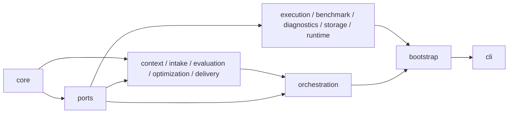

# Apex modules

Apex is organized around one controller and explicit ports. Domain modules do
not import concrete adapters; `apex.bootstrap` is the only composition root.

Each subpackage README states its public API, owned state or artifacts, dependency
boundary, and focused test command. `main.py` and the installed `apex` command
both invoke `apex.cli:main`.

## Purpose

`apex` is the application namespace for a replayable RL environment and GPU
kernel optimizer; it keeps domain policy independent of agent vendors.

## Public API

The root exports only `ApexError`, `TaskStatus`, and `ValidationLevel`. Consumers
import task-specific contracts from the owning subpackage documented below.

## Invariants

State advances through typed events, measured evidence owns rewards, and E2E
optimization changes kernels only. Presentation output is never authoritative.

## Dependencies

The root depends only on `core`; the package layer graph is enforced in
`tests/architecture` and concrete infrastructure stays behind ports.

## Failure semantics

Contract, integrity, dependency, and state-transition failures retain stable
reason codes. Missing proof does not become an inferred success.

## Tests

Run the CPU gate described in `tests/README.md`; GPU campaigns are separate and
must preserve their receipts in an explicit results directory.

## Provenance

This package is the clean-cut Apex architecture. Imported optimization knowledge
is separately attributed under `tools/perf_knowledge` and third-party notices.
